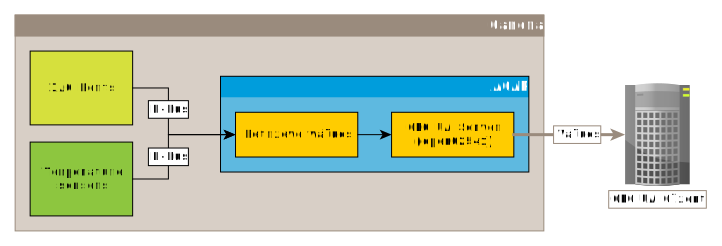
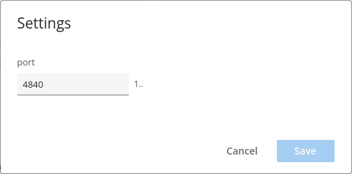

*Copyright (C) 2024, Axis Communications AB, Lund, Sweden. All Rights Reserved.*

# OPC UA Server ACAP

[](https://github.com/AxisCommunications/opc-ua-server-acap/actions/workflows/build.yml)
[](https://github.com/AxisCommunications/opc-ua-server-acap/actions/workflows/super-linter.yml)

This repository contains the source code to build a small example
[ACAP version 4](https://axiscommunications.github.io/acap-documentation/)
(native) application that uses D-Bus to get

- temperature sensor data from `com.axis.TemperatureController`
- IO port states from `com.axis.IOControl.State`

and expose them as [OPC UA](https://en.wikipedia.org/wiki/OPC_Unified_Architecture) with an
[open62541](https://open62541.org/) server. It serves as an example of how easy
it actually is to integrate any Axis device in an OPC UA system.



> [!NOTE]
> Even if this application would fit right into your usecase, its purpose is
> above all to serve as an example and boilerplate rather than being ready for
> production.

## Build

The build step creates `eap` (embedded application package) packages that can
then be deployed on the target Axis device e.g. via the device's web UI.

*For more information about the `eap` files, their content, and other ways to
deploy, please see the documentation on how to
[Develop ACAP applications](https://axiscommunications.github.io/acap-documentation/docs/develop/).*

The build uses [Docker](https://www.docker.com/) and the containerized ACAP SDK.
If you have `make` on your computer the Docker commands are nicely wrapped in
the [Makefile](Makefile). All you need to do then is:

```sh
make dockerbuild
```

or perhaps build in parallel:

```sh
make -j dockerbuild
```

If you do have Docker but no `make` on your system:

```sh
# 32-bit ARM, e.g. ARTPEC-6- and ARTPEC-7-based devices
DOCKER_BUILDKIT=1 docker build --build-arg ARCH=armv7hf -o type=local,dest=. .
# 64-bit ARM, e.g. ARTPEC-8-based devices
DOCKER_BUILDKIT=1 docker build --build-arg ARCH=aarch64 -o type=local,dest=. .
```

## Setup

### Manual installation and configuration

Upload the ACAP application file (the file with the `.eap` extension for the
camera's architecture) through the camera's web UI: *Apps->Add app*

The OPC UA Server port (default is 4840) can be set through the application's
parameter settings, found in the three vertical dots menu:




### Scripted installation and configuration

Use the camera's
[applications/upload.cgi](https://www.axis.com/vapix-library/subjects/t10102231/section/t10036126/display?section=t10036126-t10010609)
to upload the ACAP application file (the file with the `.eap` extension for the
camera's architecture):

```sh
curl -k --anyauth -u root:<password> \
    -F packfil=@OPC_UA_Server_<version>_<architecture>.eap \
    https://<camera hostname/ip>/axis-cgi/applications/upload.cgi
```

To
[start (or stop/restart/remove)](https://www.axis.com/vapix-library/subjects/t10102231/section/t10036126/display?section=t10036126-t10010606)
the application, you can make a call like this:

```sh
curl -k --anyauth -u root:<password> \
    'https://<camera hostname/ip>/axis-cgi/applications/control.cgi?package=opcuaserver&action=start'
```

Use the camera's
[param.cgi](https://www.axis.com/vapix-library/subjects/t10175981/section/t10036014/display)
to get or set the OPC UA server port number.

The call

```sh
curl -k --anyauth -u root:<password> \
    'https://<camera hostname/ip>/axis-cgi/param.cgi?action=list&group=opcuaserver'
```

will list the current setting:

```sh
root.Opcuaserver.port=4840
```

If you want to set the OPC UA server port to e.g. 4842:

```sh
curl -k --anyauth -u root:<password> \
    'https://<camera hostname/ip>/axis-cgi/param.cgi?action=update&opcuaserver.port=4842'
```

## Usage

Attach an OPC UA client to the port set in the ACAP application. The client
will then be able to read the values (and their timestamps) from the ACAP
application's OPC UA server.

> [!NOTE]
> The application will also log the values in the camera's syslog.

## License

[Apache 2.0](LICENSE)
